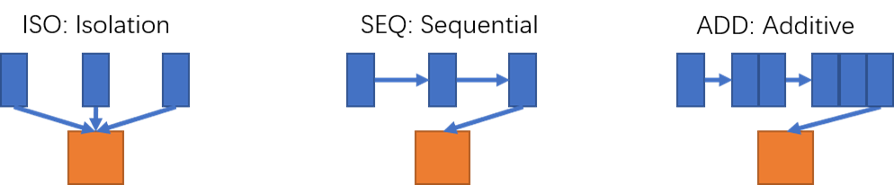

# UltraRE

This is PyTorch implementation for the paper :

"UltraRE: Enhancing RecEraser for Recommendation Unlearning via Error Decomposition"
Paper : "https://neurips.cc/virtual/2023/poster/72617"

Three collaborative filtering models: 

- Matrix Factorization (GMF)
- Neural Matrix Factorization (NeuMF)
- Neural Collaborative Filtering(NCF)

Three division methods:

- Kmeans
- Balanced Kmeans
- OT based clustering

Three unlearning workflow:

- Isolation
- Sequential
- Additive

As this figure, Isolation means that we divide original dataset into several groups and then train models with these groups respectively. Sequential means that we train first model with first group and then fine-tune this model n-1 times with group-i each time. Additive means that we train first model with first group and then fine-tune with groups whose index is less than i each time. (i means the index of group)



## Environment Settings

- PyTorch versipn : 1.13.0

- POT version : 0.9.0

## Example to run the codes.

The instruction of commands has been clearly stated in the codes (see the  parse_args function). 

Train model:

```python
python main.py --dataset ml1m --epoch 50 --group 0 
```

Unlearn:

```python
python main.py --dataset ml1m --epoch 50 --group 5 --learn sisa --delper 2 --deltype rand
```

Note you can edit this two functions to change the backbone model

```
config.py run_Group() run_Full()  
```

Also you can add dataset by editing config.py

## Dataset

We provide one processed datasets : MovieLens 1 Million (ml-1m)  in data/ml1m/

ratings.dat : original interaction data

pro.ipynb : process data and split the train/test data

## Test
Run test.ipynb to compare the performance of several clustering methods
